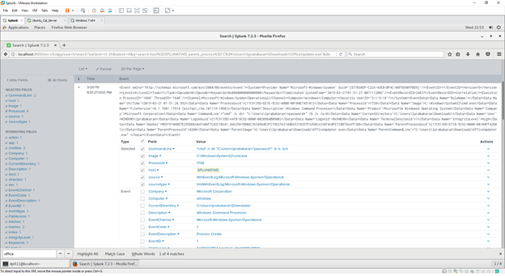

# Technique Description
## T1078 - Valid Accounts
## [Description from ATT&CK](https://attack.mitre.org/techniques/T1119/) 
Once established within a system or network, an adversary may use automated techniques for collecting internal data. Methods for performing this technique could include use of Scripting to search for and copy information fitting set criteria such as file type, location, or name at specific time intervals. This functionality could also be built into remote access tools.

This technique may incorporate use of other techniques such as File and Directory Discovery and Remote File Copy to identify and move files.

# Assumption
We are assuming in this scenario that the machine has already been compromised by a malicious EXE such as in our previous example with the trusted relationship. Rather than relying on the RAT which may trigger IDS/AV in the future, the threat actor uses the RAT to create a valid acccount which will then be used for persistence. 

# Execution
Caldera was used 

**Test 1 -**

Here is our use of Caldera in browsing the directories of the compromised machine in order to find sensitive data. 

# Detection
Depending on the method used, actions could include common file system commands and parameters on the command-line interface within batch files or scripts. A sequence of actions like this may be unusual, depending on the system and network environment. Automated collection may occur along with other techniques such as Data Staged. As such, file access monitoring that shows an unusual process performing sequential file opens and potentially copy actions to another location on the file system for many files at once may indicate automated collection behavior. Remote access tools with built-in features may interact directly with the Windows API to gather data. Data may also be acquired through Windows system management tools such as Windows Management Instrumentation and PowerShell.

## Splunk Filter
The following splunk query will allow us to detect these techniques

**Filter 1 -**

