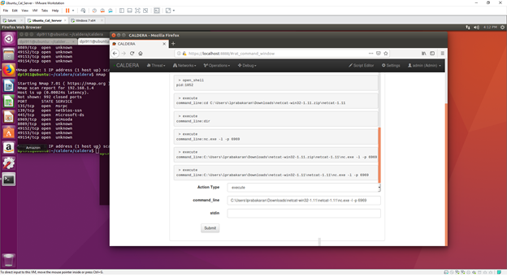
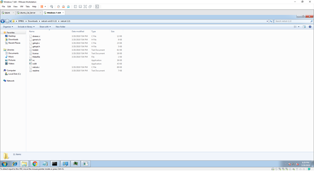
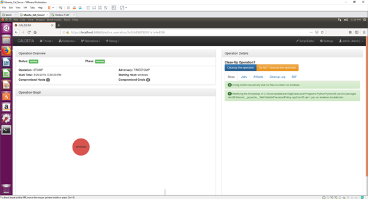

# Technique Description
## T1099 - Timestomp
## [Description from ATT&CK](https://attack.mitre.org/techniques/T1099/) 
Timestomping is a technique that modifies the timestamps of a file (the modify, access, create, and change times), often to mimic files that are in the same folder. This is done, for example, on files that have been modified or created by the adversary so that they do not appear conspicuous to forensic investigators or file analysis tools. Timestomping may be used along with file name Masquerading to hide malware and tools.

# Assumption
We are assuming in this scenario that the machine has already been compromised by a malicious EXE such as in our previous example with the trusted relationship. Rather than relying on the RAT which may trigger IDS/AV in the future, the threat actor uses the RAT to create a valid acccount which will then be used for persistence. 

# Execution
This attack was executed using a reverse tcp meterpreter session which contains the timestomp features. 

**Test 1 -**

Here is our use of Caldera in creating a reverse netcat session using the rat.

Here is the evidence of the timestomped files.

Here is further timestomping using Caldera.

# Detection
Forensic techniques exist to detect aspects of files that have had their timestamps modified. It may be possible to detect timestomping using file modification monitoring that collects information on file handle opens and can compare timestamp values.

## Splunk Filter
This was not possible given the current tools at hand with splunk.

