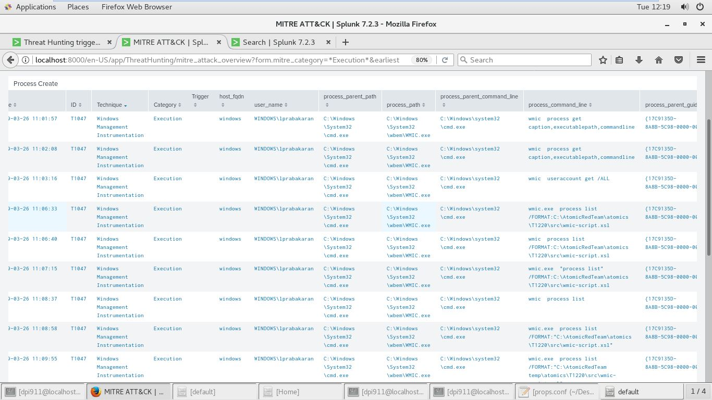
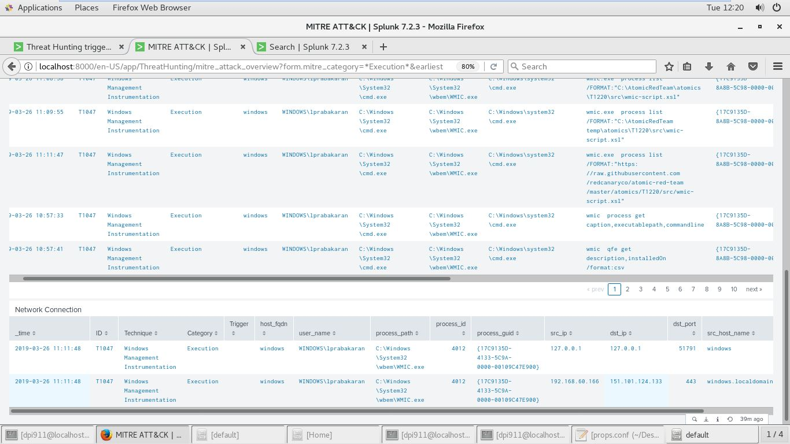

# Technique Description
## T1047 - Windows Management Instrumentation
## [Description from ATT&CK](https://attack.mitre.org/techniques/T1047/) 
>Windows Management Instrumentation (WMI) is a Windows administration feature that provides a uniform environment for local and remote access to Windows system components. It relies on the WMI service for local and remote access and the server message block (SMB) and Remote Procedure Call Service (RPCS) for remote access. RPCS operates over port 135. An adversary can use WMI to interact with local and remote systems and use it as a means to perform many tactic functions, such as gathering information for Discovery and remote Execution of files as part of Lateral Movement.

# Assumption

# Execution
The Atomic-Red-Team T1047 module describes the test for this technique: https://github.com/redcanaryco/atomic-red-team/blob/master/atomics/T1047/T1047.md

**Test 1 - WMI Reconnaissance Users:**

**Test 2 - WMI Reconnaissance Processes:**

**Test 3 - WMI Reconnaissance Software:**

**Test 4 - WMI Reconnaissance List Remote Services:**

# Detection
Detection is done by monitoring processes, command line arguments ("wmic") and network traffic for WMI connections; the use of WMI in environments that do not typically use WMI may be suspect.

**Detection 1 - Local "wmic" Process Creation**

**Detection 2 - Remote "wmic.exe" Network Connection**
