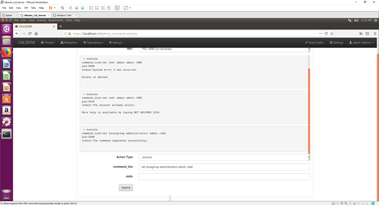
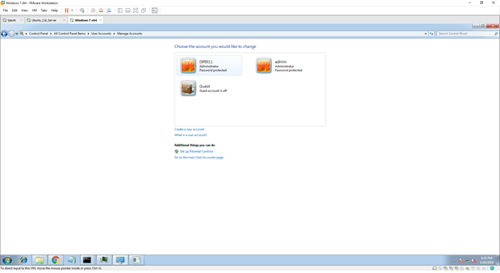
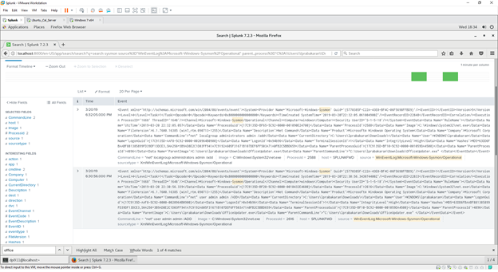

# Technique Description
## T1078 - Valid Accounts
## [Description from ATT&CK](https://attack.mitre.org/techniques/T1078/) 
>Adversaries may steal the credentials of a specific user or service account using Credential Access techniques or capture credentials earlier in their reconnaissance process through social engineering for means of gaining Initial Access. Compromised credentials may be used to bypass access controls placed on various resources on systems within the network and may even be used for persistent access to remote systems and externally available services, such as VPNs, Outlook Web Access and remote desktop. Compromised credentials may also grant an adversary increased privilege to specific systems or access to restricted areas of the network. Adversaries may choose not to use malware or tools in conjunction with the legitimate access those credentials provide to make it harder to detect their presence.

# Assumption
We are assuming in this scenario that the machine has already been compromised by a malicious EXE such as in our previous example with the trusted relationship. Rather than relying on the RAT which may trigger IDS/AV in the future, the threat actor uses the RAT to create a valid acccount which will then be used for persistence. 

# Execution
This technique did not have a red atomic module

**Test 1 -**

Here is our use of Caldera in creating a valid account remotely using the RAT. 

Here is the valid account created on the victim machine.

# Detection
Configure robust, consistent account activity audit policies across the enterprise and with externally accessible services. Look for suspicious account behavior across systems that share accounts, either user, admin, or service accounts. Activity may be from interactive login sessions or process ownership from accounts being used to execute binaries on a remote system as a particular account. Correlate other security systems with login information (e.g., a user has an active login session but has not entered the building or does not have VPN access). Perform regular audits of domain and local system accounts to detect accounts that may have been created by an adversary for persistence.

## Splunk Filter
The following splunk query will allow us to detect these techniques

**Filter 1 -**

