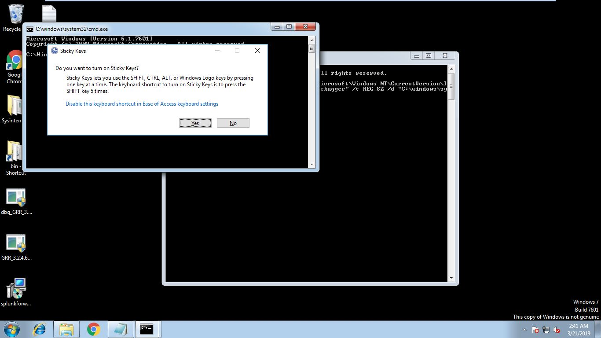
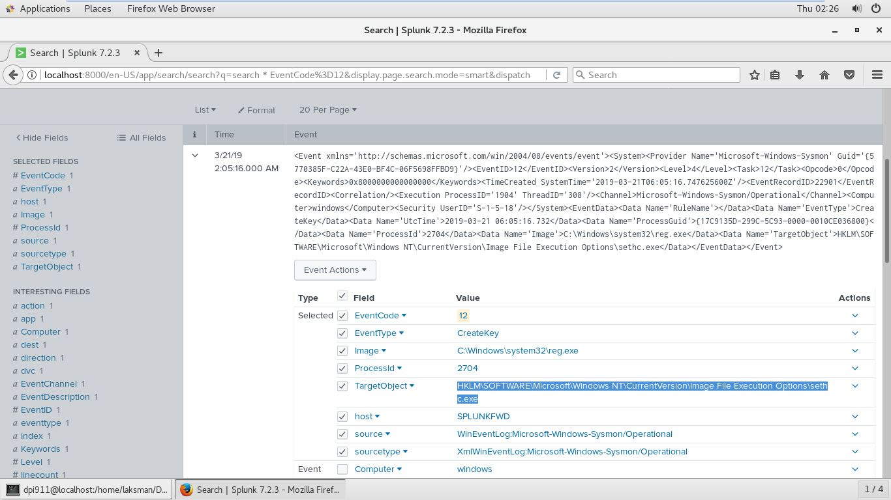
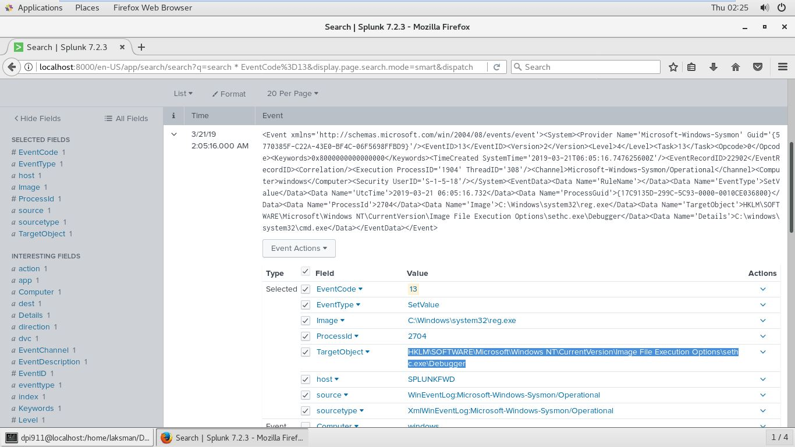
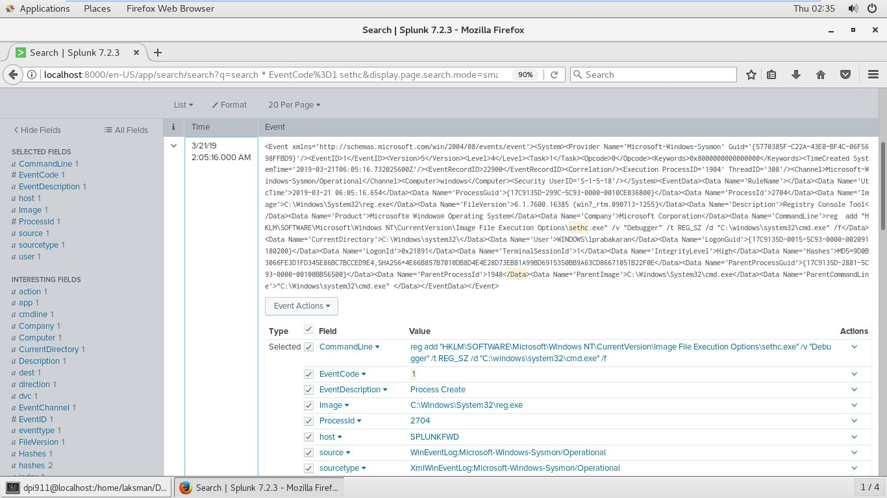
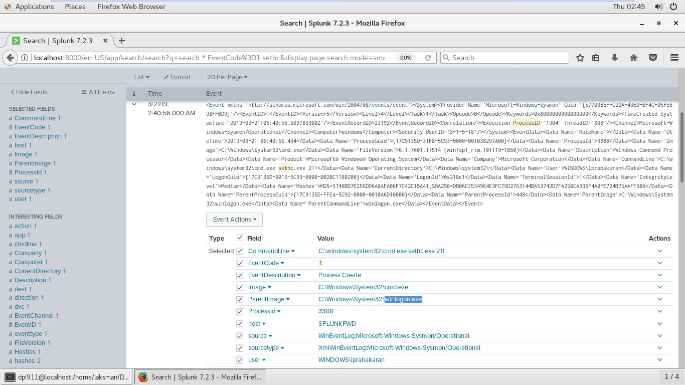
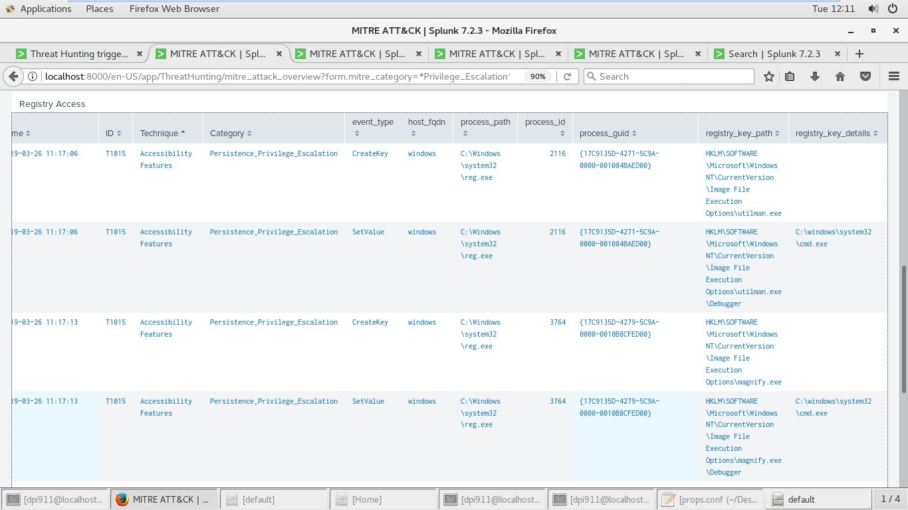

# Technique Description
## T1015 - Accessibility Features
## [Description from ATT&CK](https://attack.mitre.org/techniques/T1015/) 
>Windows contains accessibility features that may be launched with a key combination before a user has logged in (for example, when the user is on the Windows logon screen). An adversary can modify the way these programs are launched to get a command prompt or backdoor without logging in to the system.
>
>Two common accessibility programs are C:\Windows\System32\sethc.exe, launched when the shift key is pressed five times and C:\Windows\System32\utilman.exe, launched when the Windows + U key combination is pressed. The sethc.exe program is often referred to as "sticky keys", and has been used by adversaries for unauthenticated access through a remote desktop login screen. 
>Other accessibility features exist that may also be leveraged in a similar fashion:
>
>On-Screen Keyboard: C:\Windows\System32\osk.exe
>Magnifier: C:\Windows\System32\Magnify.exe
>Narrator: C:\Windows\System32\Narrator.exe
>Display Switcher: C:\Windows\System32\DisplaySwitch.exe
>App Switcher: C:\Windows\System32\AtBroker.exe

# Execution
The Atomic-Red-Team T1015 module describes the test for this technique: https://github.com/redcanaryco/atomic-red-team/blob/master/atomics/T1015/T1015.md

**Test 1 - Attach Command Prompt As Debugger To Process sethc:**

**Test 2 - Launch cmd using sethc:**

# Detection
Changes to accessibility utility binaries or binary paths that do not correlate with known software, patch cycles, etc., are suspicious. Command line invocation of tools capable of modifying the Registry for associated keys are also suspicious. Utility arguments and the binaries themselves should be monitored for changes. Monitor Registry keys within HKEY_LOCAL_MACHINE\SOFTWARE\Microsoft\Windows NT\CurrentVersion\Image File Execution Options.

**Detection 1 - Registy Key Created for Attaching Command Prompt As Debugger**

**Detection 2 - Registry Key SetValue for Attaching Command Prompt As Debugger**

**Detection 3 - Command Line Argument for Attaching Command Prompt As Debugger**

**Detection 4 - Proccess Create for Command Prompt using Sticky Keys**

**Detection 5 - Proccess Creation Detection for other Accessibility Executables**
